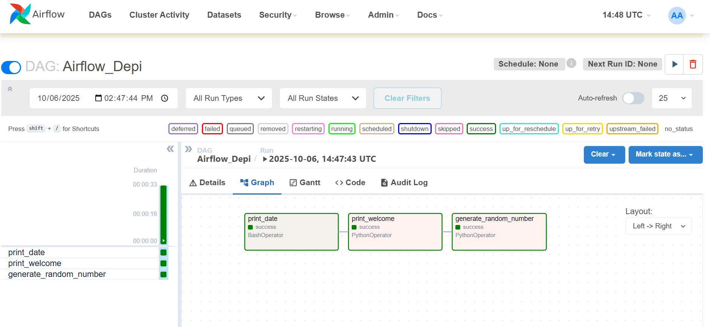

  

<h1 align="center"> Airflow Mini Project – DAG with Three Tasks</h1>

  <b>A simple Apache Airflow project demonstrating task scheduling, dependencies, and logging.</b>

---

## Project Overview
This project demonstrates a simple **Apache Airflow DAG** that executes three independent tasks. Each task performs a basic Python operation, and the DAG is designed to run sequentially. The project serves as a hands-on example to understand how Airflow schedules, runs, and logs tasks.

---

## ⚙️ How It Works
The DAG includes **three tasks** executed in order:

date_task → welcome_task → random_task

yaml
Copy code

All logs are stored and can be viewed in the Airflow web UI.

---

## Project Structure

airflow_dag_project/
│
├── dags/
│ └── mini_dag.py
│
├── images/
│ ├── graph.png
│ ├── date_log.png
│ ├── welcome_log.png
│ └── random_log.png
│
└── README.md

yaml
Copy code

---

## DAG Graph
Below is the DAG visualization from the Airflow UI:

  

---

## Task Logs
Below are screenshots showing the log outputs of each task:

### Task 1 – Date Log

  

### Task 2 – Welcome Message

  

### Task 3 – Random Number Generation

  

---

## Key Takeaways
- Learned how to define and connect multiple tasks in Airflow.  
- Understood how task dependencies work (`>>`, `<<`).  
- Practiced viewing logs and monitoring DAG execution flow.

---

## Author
**Belal – Engineer & AI Enthusiast**  
Exploring automation and intelligent systems through practical Airflow projects.

  <a href="https://github.com/">GitHub</a> · 
  <a href="https://airflow.apache.org/">Apache Airflow</a>

---

## 🏷️ Tags
`Apache Airflow` · `Python` · `Data Engineering` · `Automation` · `Task Scheduling`
